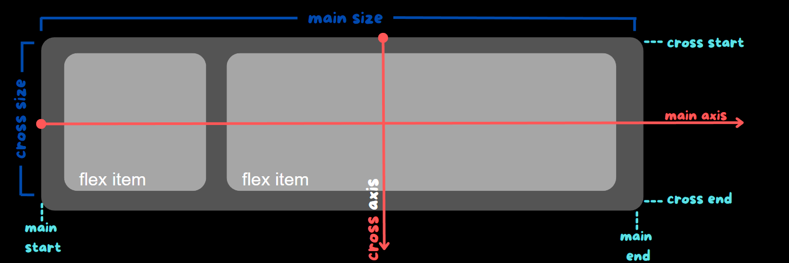
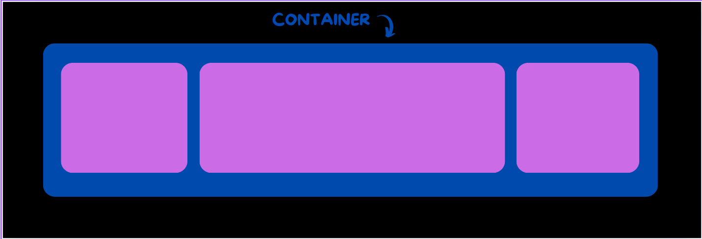

# Flexbox

## 🚀 Começando

Este projeto tem como objetivo explicar o Flexbox, uma técnica de layout no CSS que facilita a criação de designs responsivos e flexíveis. Vou abordar os diferentes tipos de propriedades do Flexbox e como usá-las para organizar e alinhar itens em uma página web. O foco será em como aplicar essas propriedades para criar layouts que se ajustam automaticamente a diferentes tamanhos de tela.

### 📋 Noções Básicas 
Flexbox não é uma propriedade única, envolve muitas coisas, incluindo seu conjunto de propriedades. Algumas delas devem ser definidas no contêiner (conhecido como flex container) enquanto outras devem ser definidas como “flex items”.

Imagine que você tem uma caixa e quer organizar seus items dentro dela. No layout tradicional, você pode colocar os brinquedos em uma linha ou em uma coluna, como uma fila ou uma pilha. Com o Flexbox, você pode escolher como quer que os items se organizem, podendo decidir se eles ficam alinhados de um jeito ou de outro, e até mudar a direção dependendo de como a caixa está posicionada. É como ter uma caixa que se ajusta automaticamente para organizar seus items da melhor forma possível!

<p align="center" width="700">
    
</p>

Os itens serão dispostos seguindo o eixo main axis (from main-start to main-end) ou o eixo transversal (from cross-start to cross-end).

* 	Eixo principal – O eixo principal de um flex container é o eixo primário ao longo do qual os flex items são dispostos. Cuidado, ele não é necessariamente horizontal; depende da flex-directionpropriedade .
* 	Main-start | main-end – Os itens flexíveis são colocados dentro do contêiner começando em main-start e indo até main-end.
* 	Tamanho principal – A largura ou altura de um item flex, o que estiver na dimensão principal, é o tamanho principal do item. A propriedade de tamanho principal do item flex é a propriedade 'width' ou 'height', o que estiver na dimensão principal.
* 	Eixo transversal – O eixo perpendicular ao eixo principal é chamado de eixo transversal. Sua direção depende da direção do eixo principal.
* 	Cross-start | cross-end – As linhas flexíveis são preenchidas com itens e colocadas no contêiner, começando no lado de cross-start do contêiner flexível e indo em direção ao lado de cross-end.
* 	Cross size – A largura ou altura de um item flex, o que estiver na dimensão cross, é o tamanho cross do item. 

**Flex container** é um elemento. Para definir que um elemento é um Flex Container com a propriedade **display** e valores **flex** ou **inline-flex.**

Código em HTML: 
```
<div class="flex-container">
    <div>1</div>
  </div>
```
O código no CSS:
```
.flex-container {
    display: flex;
  }
```
**Flex Item** são elementos-filhos do flex container.
**Eixos ou Axes** são direções que existem em um Flex Container: main axis (eixo principal), e cross axis (eixo transversal).

### :man: Propriedades para o elemento-pai
<p align="center" width="700">
    
</p>

Para usar o flexbox é muito importante saber quais propriedades são colocadas no elemento-pai(container), por exemplo uma **div** que vai ter elementos para serem alinhados. E quais serão declaradas nos elementos-filhos. Abaixo, vamos mostrar exemplos de propriedades que devem ser declaradas utilizando o elemento-pai.

#### display
Essa propriedade cria um flex container para os elementos dentro dele. Dependendo dos valores que você usa, o container pode se comportar como um bloco ou como um elemento em linha. Ela organiza todos os elementos filhos diretos usando o modelo Flexbox

<p align="center" width="700">
    
</p>

```
vai o codigo aqui
```

### flex-direction
Essa propriedade define a direção dos itens dentro do flex container. Ela estabelece o eixo principal ao longo do qual os itens são organizados. O Flexbox trabalha principalmente em uma direção de cada vez, seja horizontal ou vertical.

<p align="center" width="700">
    
</p>

```
vai o codigo aqui
```

* row (padrão): Alinha os itens horizontalmente, da esquerda para a direita em layouts da esquerda para a direita (ltr) e da direita para a esquerda em layouts da direita para a esquerda (rtl).
* row-reverse: Alinha os itens horizontalmente, mas da direita para a esquerda em ltr e da esquerda para a direita em rtl.
* column: Alinha os itens verticalmente, de cima para baixo.
* column-reverse: Alinha os itens verticalmente, mas de baixo para cima.

### flex-wrap
Por padrão, todos os itens dentro do flex container tentam se ajustar em uma única linha. A propriedade flex-wrap permite alterar esse comportamento para que os itens possam quebrar e se mover para a linha seguinte, conforme necessário.

<p align="center" width="700">
    
</p>

```
vai o codigo aqui
```

* nowrap (padrão): Todos os itens flexíveis permanecem em uma única linha, mesmo que o container não seja grande o suficiente para acomodá-los.
* wrap: Os itens flexíveis se movem para a linha seguinte quando a linha atual está cheia, organizando-se de cima para baixo.
* wrap-reverse: Os itens flexíveis se movem para a linha seguinte quando a linha atual está cheia, mas organizam-se de baixo para cima.

### flew-flow
A propriedade flex-flow é uma forma abreviada de definir duas propriedades ao mesmo tempo: flex-direction e flex-wrap. Ela determina a direção dos itens dentro do container flexível e se eles devem ou não quebrar para a próxima linha.

<p align="center" width="700">
    
</p>

```
vai o codigo aqui
```

### justify-content
Essa propriedade ajusta o alinhamento dos itens ao longo do eixo principal e distribui o espaço livre restante no contêiner. Ela controla como os itens são alinhados e espaçados, mesmo quando há mais itens do que o espaço disponível na linha.

* **flex-start:** Alinha todos os itens no início da linha, de acordo com a direção do contêiner (por exemplo, à esquerda se a direção for da esquerda para a direita).
* **flex-end:** Alinha todos os itens no final da linha, de acordo com a direção do contêiner (por exemplo, à direita se a direção for da esquerda para a direita).
* **start:** Alinha os itens no início da direção de escrita (por exemplo, à esquerda em um idioma que lê da esquerda para a direita).
* **end:** Alinha os itens no final da direção de escrita (por exemplo, à direita em um idioma que lê da esquerda para a direita).
* **left:** Alinha os itens à borda esquerda do contêiner, mas pode se comportar como start dependendo da direção do contêiner.
* **right:** Alinha os itens à borda direita do contêiner, mas pode se comportar como start dependendo da direção do contêiner.
* **center:** Centraliza os itens na linha.
* **space-between:** Distribui os itens com o primeiro item na borda inicial e o último item na borda final da linha. O espaço restante é distribuído uniformemente entre os itens.
* **space-around:** Distribui os itens com o mesmo espaço ao redor de cada item. O primeiro item terá menos espaço à borda do contêiner comparado ao espaço entre os itens.
* **space-evenly:** Distribui os itens com o mesmo espaço entre todos os itens e as bordas do contêiner, garantindo que o espaço entre qualquer dois itens seja igual.

 <p align="center" width="700">
    
</p>

```
vai o codigo aqui
```

 


